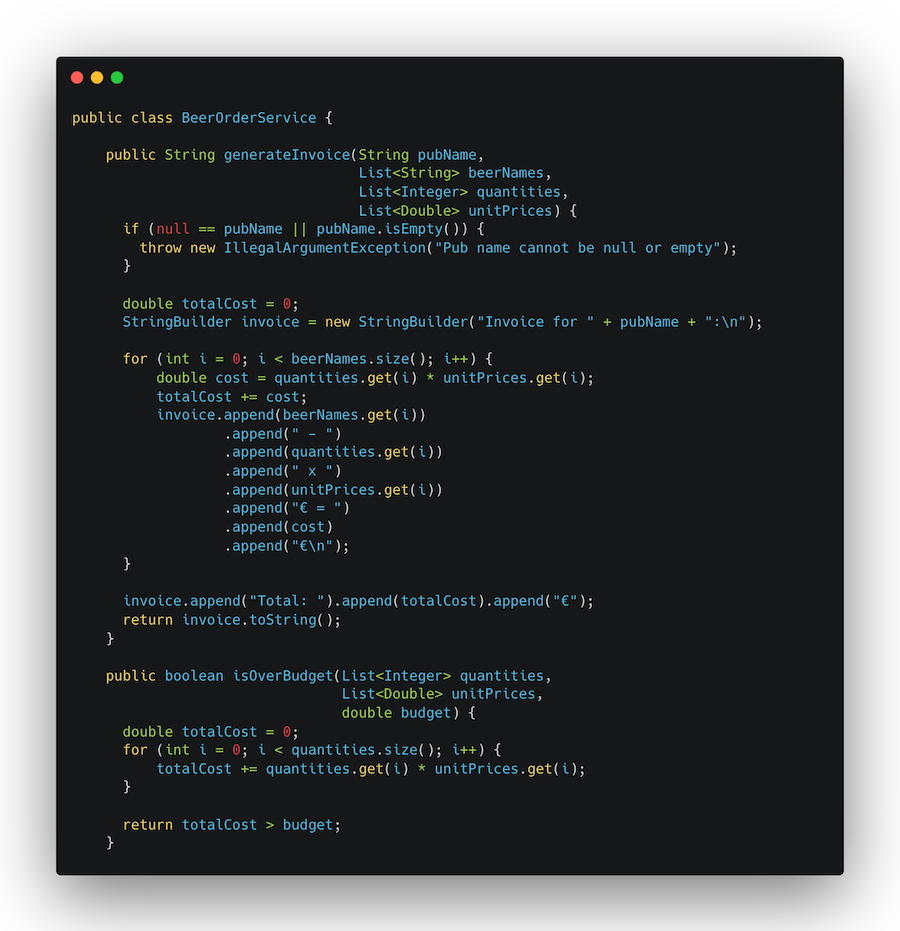

# Kata for the Saint Patrick's day
--------------------------------
## 🍀 St. Patrick’s Beer Order System: The Chaos of Raw Numbers!

> **_Inspired:_** This exercise is inspired by an existing exercise from [Advent of Craft 2024](https://github.com/advent-of-craft/2024). We highly recommend their exercises and sincerely thank them for their excellent work.

Patrick runs a beer delivery service for St. Patrick’s Day. 🍻
Each pub orders different types of beer in varying amounts.

Unfortunately, the system currently tracks everything with raw numbers. Pubs specify their beer type, quantity, price per unit, and total cost, but sometimes mistakes happen—people mix up quantities and prices, leading to financial chaos! 💰💸

Last year, O’Malley’s Pub accidentally ordered 50 kegs instead of 50 pints, and Patrick had to cover the loss.

Let’s refactor this messy system and make things safer!

