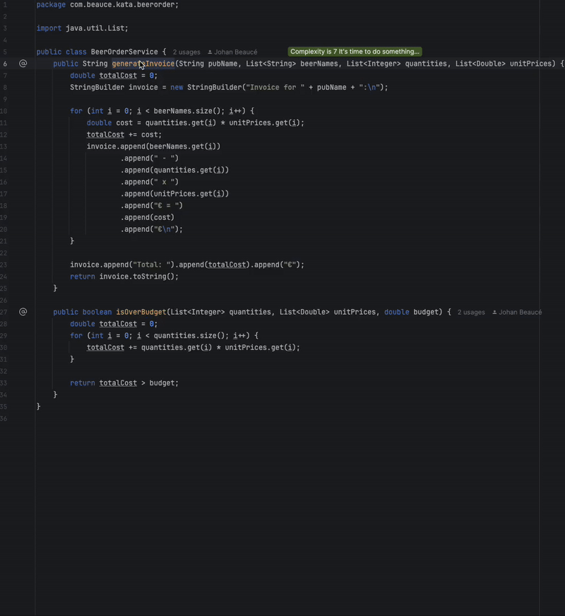

# Step by step refactoring

## Step 1: create a `Pub` object

The first parameter of the generateInvoice method is a string with the value "O’Malley’s Pub", which represents a pub.
Instead of using a plain string, the pub should be a class. So, let’s create a `Pub`.

Replace:

```java
var invoice = service.generateInvoice(
        "O’Malley’s Pub",
        ...
```

By

```java
var pub = new Pub("O’Malley’s Pub");
var invoice = service.generateInvoice(
        pub.name(),
        ...
```

Tip: Use the refactoring **Introduce Parameter Object** to create the `Pub` record.



**[Primitive Obsession](https://xtrem-tdd.netlify.app/Flavours/Design/no-primitive-types)** is a common code smell where primitive types (String, int, double, etc.) are used
inappropriately to represent domain concepts.
This leads to scattered validation rules, unclear intent, and code duplication.

In this refactoring, we addressed **Primitive Obsession** by introducing **Value Objects**, encapsulating domain logic
inside small, well-defined classes such as `Pub`, `Beer`, `UnitPrice`, and `Quantity`.


## Step 2: create a `Beer` object

Modify the test to use a `Beer` object instead of a `string` and a `double`:

```java
var pub = new Pub("O’Malley’s Pub");
var guinnessBeer = new Beer("Guinness", 5.0);
var kilkennyBeer = new Beer("Kilkenny", 4.5);
var invoice = service.generateInvoice(
        pub.name(),
        List.of(guinnessBeer.name(), kilkennyBeer.name()),
        List.of(10, 5),
        List.of(guinnessBeer.price(), kilkennyBeer.price())
);
```

Create a `Beer` record:

```java
public record Beer(String name, double price) {
    public Beer {
        
        // Tip: introduce validation rules like those below
        if (null == name || name.isEmpty()) {
            throw new IllegalArgumentException("Beer name cannot be null or empty");
        }
        if (price <= 0) {
            throw new IllegalArgumentException("Beer price must be greater than 0");
        }
    }
}
```

## Step 3: create a BeerOrder object

The `generateInvoice` method should take a `Pub` and a list of `BeerOrder` objects.

```java
List<BeerOrder> beerOrders = new ArrayList<>();
beerOrders.add(new BeerOrder(guinnessBeer, 10));
beerOrders.add(new BeerOrder(kilkennyBeer, 5));
var invoice = service.generateInvoice(pub, beerOrders);
```
To do so, we can use the **[Strangler Fig Pattern](https://xtrem-tdd.netlify.app/Flavours/Refactoring/strangler-pattern)** to refactor the code incrementally, 
replacing the old code with the new one step by step.

Create the new method with the wanted signature:

```java
public String generateInvoiceNew(Pub pub, List<BeerOrder> beerOrders) {
    throw new NotImplementedException();
}
```

Write a test to make it fail (first step of TDD).

```java
@Test
void shouldGenerateInvoiceCorrectlyNew() {
  var pub = new Pub("O’Malley’s Pub");
  var guinnessBeer = new Beer("Guinness", 5.0);
  var kilkennyBeer = new Beer("Kilkenny", 4.5);
  List<BeerOrder> beerOrders = List.of(
          new BeerOrder(guinnessBeer, 10),
          new BeerOrder(kilkennyBeer, 5)
  );

  var invoice = service.generateInvoiceNew(pub, beerOrders);

  assertThat(invoice)
          .contains(
                  "Guinness - 10 x 5.0€ = 50.0€",
                  "Kilkenny - 5 x 4.5€ = 22.5€",
                  "Total: 72.5€");
}
```
Make it pass as quickly as possible by calling the old method from the new one.

```java
public String generateInvoiceNew(Pub pub, List<BeerOrder> beerOrders) {
  return this.generateInvoice(pub,
          beerOrders.stream()
                  .map(BeerOrder::beer)
                  .map(Beer::name)
                  .toList(),
          beerOrders.stream()
                  .map(BeerOrder::quantity)
                  .toList(),
          beerOrders.stream()
                  .map(BeerOrder::beer)
                  .map(Beer::price)
                  .toList());
}
```
Our new method is calling the old one so the behavior is guaranteed to be the same. 
Now we can start refactoring the new method safely.

```java
public String generateInvoiceNew(Pub pub, List<BeerOrder> beerOrders) {
  StringBuilder result = new StringBuilder("Invoice for %s:\n".formatted(pub.name()));
  for (var beerOrder : beerOrders) {
    result.append("%s - %d x %.1f€ = %.1f€\n".formatted(
            beerOrder.beer().name(),
            beerOrder.quantity(),
            beerOrder.beer().price(),
            beerOrder.totalPrice()));
  }
  result.append("Total: %.1f€".formatted(beerOrders.stream()
          .mapToDouble(BeerOrder::totalPrice)
          .sum()));
  return result.toString();
}
```
At this point, we can remove the old method and the old test.
Then, we can rename the new method to `generateInvoice`.


### Refactoring: Introduce a `BeerOrders` Collection

To improve code structure, create a first-class collection for `BeerOrder` objects.

```java
var beerOrders = new BeerOrders(
        new BeerOrder(guinnessBeer, 10),
        new BeerOrder(kilkennyBeer, 5));
var invoice = service.generateInvoice(pub, beerOrders);
```

Create the `BeerOrders` class:

```java
public class BeerOrders {
    private final List<BeerOrder> beerOrders;

    public BeerOrders(BeerOrder... beerOrders) {
        if (beerOrders == null || beerOrders.length == 0) {
            throw new IllegalArgumentException("BeerOrders cannot be empty");
        }
        this.beerOrders = List.of(beerOrders);
    }

    public void forEach(Consumer<BeerOrder> action) {
        beerOrders.forEach(action);
    }

    public double getTotalPrice() {
        return beerOrders.stream()
                .mapToDouble(BeerOrder::totalPrice)
                .sum();
    }
}
```

Modify `generateInvoice` method to use `BeerOrders`:

```java
public String generateInvoice(Pub pub,
                              BeerOrders beerOrders) {
    var result = new StringBuilder("Invoice for %s:\n".formatted(pub.name()));
    beerOrders.forEach(beerOrder -> result.append("%s - %d x %.1f€ = %.1f€\n".formatted(
            beerOrder.beer().name(),
            beerOrder.quantity(),
            beerOrder.beer().price(),
            beerOrder.totalPrice())));
    result.append("Total: %.1f€".formatted(beerOrders.getTotalPrice()));
    return result.toString();
}
```

## Step 4: Modify `isOverBudget` method

Change the test `shouldDetectOverBudgetOrders` and `shouldNotDetectOverBudgetOrders`, the `isOverBudget` method should
take a `BeerOrders` object and a `budget`.

```java

@Test
void shouldDetectOverBudgetOrders() {
    var beerOrders = new BeerOrders(
            new BeerOrder(new Beer("Beer1", 6.0), 20),
            new BeerOrder(new Beer("Beer2", 5.5), 15));
    assertThat(service.isOverBudget(beerOrders, 100.0))
            .isTrue();
}

@Test
void shouldNotDetectOverBudgetOrders() {
    var beerOrders = new BeerOrders(
            new BeerOrder(new Beer("Beer1", 5.0), 5),
            new BeerOrder(new Beer("Beer2", 4.0), 2));
    assertThat(service.isOverBudget(beerOrders, 100.0))
            .isFalse();
}
```

Modify `isOverBudget`:

```java
public boolean isOverBudget(BeerOrders beerOrders,
                            double budget) {
    return beerOrders.getTotalPrice() > budget;
}
```

## Step 5: create `Invoice` to refactor the `generateInvoice` method

Modify `generateInvoice` method to use an `Invoice`:

```java
    public String generateInvoice(Pub pub,
                                  BeerOrders beerOrders) {
    return new Invoice(pub, beerOrders)
            .generate();
}
```

Create `Invoice` record:

```java
public record Invoice(Pub pub, BeerOrders beerOrders) {
    public Invoice {
        if (null == pub) {
            throw new IllegalArgumentException("Pub cannot be null");
        }
        if (null == beerOrders) {
            throw new IllegalArgumentException("BeerOrders cannot be null");
        }
    }

    public String generate() {
        return null;
    }
}
```

Implement `generate` method; use a string a delegate the formatting to `BeerOrders`.

```java
public String generate() {
    return """
            Invoice for %s:
            %s
            Total: %s€""".formatted(pub.name(), beerOrders.toString(), beerOrders.getTotalPrice());
}
```

Implement `toString` method in `BeerOrders` class:

```java

@Override
public String toString() {
    return beerOrders.stream()
            .map(Record::toString)
            .collect(Collectors.joining("\n"));
}
```

Implement the `toString` method in `BeerOrder` class:

```java

@Override
public String toString() {
    return "%s - %d x %s€ = %s€"
            .formatted(beer.name(), quantity, beer.price(), totalPrice());
}
```

## Step 6: create a `UnitPrice` and `Quantity` class

Modify test `shouldDetectOverBudgetOrders` to use the `UnitPrice` and `Quantity` classes.

```java
var guinnessBeer = new Beer("Guinness", new UnitPrice(5.0));
var kilkennyBeer = new Beer("Kilkenny", new UnitPrice(4.5));
var beerOrders = new BeerOrders(
        new BeerOrder(guinnessBeer, new Quantity(10)),
        new BeerOrder(kilkennyBeer, new Quantity(5)));
```

Create the `Quantity` class:

```java
public record Quantity(int quantity) {
    public Quantity {
        if (quantity <= 0) {
            throw new IllegalArgumentException("Quantity must be greater than 0");
        }
    }
}
```

Like this we can delegate the verification of the quantity to the `Quantity` class.
Then, we do the same for `UnitPrice`; so that we can delegate the multiplication of the quantity by the price to
`UnitPrice`.

```java
public record UnitPrice(double value) {
    public UnitPrice {
        if (value <= 0) {
            throw new IllegalArgumentException("Price must be greater than 0");
        }
    }

    public double multiplyBy(Quantity quantity) {
        return BigDecimal.valueOf(value())
                .multiply(BigDecimal.valueOf(quantity.value()))
                .setScale(1, RoundingMode.HALF_UP)
                .doubleValue();
    }
}
```

# Conclusion

Through this step-by-step refactoring, we have improved the design of our `generateInvoice` method by introducing *
*Value Objects** and a **First-Class Collection**, two essential object-oriented design patterns that enhance code
clarity, maintainability and robustness.

1. **Value Objects**

We replaced primitive data types (e.g., String for pub names, double for beer prices, int for quantities) with
domain-specific types such as `Pub`, `Beer`, `UnitPrice`, and `Quantity`.
**Value Objects** bring several benefits:

* **Encapsulation of domain logic**: Business rules (e.g., “a price must be greater than zero”) are now self-contained
  within their respective classes.
* **Immutability**: Once created, a value object cannot be modified, ensuring safe and predictable behavior.
* **Equality by value**: Two Beer objects with the same name and price are considered equal, reinforcing business logic
  consistency.

2. **First-Class Collection**

Instead of working with `List<BeerOrder>`, we introduced a dedicated `BeerOrders` record, making the collection a *
*first-class** citizen in our domain model.
Benefits include:

* **Encapsulation of collection-specific logic**: Methods like `getTotalPrice()` are now inside `BeerOrders`, reducing
  code duplication in services.
* **Stronger domain modeling**: The collection is no longer a generic List, but an explicit domain concept, improving
  readability and maintainability.

These principles—**Value Objects** and **First-Class Collections**—are fundamental in **Domain-Driven Design** (DDD),
where modeling the business domain accurately leads to more robust and scalable applications. By applying them, our
invoice generation logic is not only easier to understand but also more resistant to errors.


